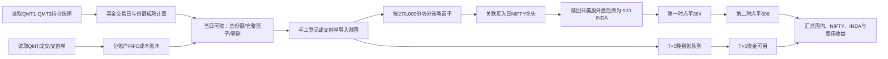

# 164824 印度基金赎回收益计算器改造方案

> 目标目录：`/Users/ellis/Desktop/ETF交割/赎回收益计算器V3_印度`
>
> 文档用途：供后续 Agent 直接按阶段实施代码改造。本次只完成评估和详细设计，不解析尚未取得的 164824 实际赎回交割单，也不发送任何交易指令。
>
> 编制日期：2026-08-05

---

# 第一部分：总体改造方案（业务与使用者视角）

## 1. 结论先行

目标程序不能通过把 `159518/XOP` 常量替换为 `164824/INDA` 完成改造。当前目标目录仍是原 V3 的完整复制，核心代码与 `/Users/ellis/Desktop/ETF交割/赎回收益计算器V3` 逐文件一致，且 `config.json` 中多个缓存路径仍指向旧 V3 目录。

现程序的主模型是：

```text
159518 ETF赎回
  -> 读取PCF
  -> 等待T+3现金差额
  -> 等待T+6现金替代退款
  -> 每100万份匹配990股XOP
  -> XOP单腿开仓/平仓盈亏
```

164824 需要的新模型是：

```text
164824 LOF买入与持仓
  -> 按基金交易日判断份额成熟和当日可赎量
  -> 手工登记或从交割单导入赎回申请
  -> 每270,000份形成一个“策略篮子”
  -> 对应1张NIFTY空头与970股INDA空头
  -> 美股开盘后NIFTY换仓为INDA
  -> 赎回日分两段平掉INDA
  -> T+5晚交割单入账、T+6资金可用
  -> 以实际/估算赎回净款、国内FIFO成本、NIFTY与INDA盈亏计算总收益
```

建议保留原 V3 已验证的四项基础能力：QMT 文件兼容读取、IB Flex 自动缓存、成交按数量切片、PyQt 审计型表格；其余 XOP/PCF 专属模型应隔离后重写。

## 2. 已确认的现状

### 2.1 目标程序现状

- `redemption_engine.py` 硬编码 `TARGET_CODE = 159518`、`TARGET_FOREIGN_CODE = XOP`、最小申赎单位 `1,000,000`、单篮对冲 `990` 股。
- QMT1/QMT2 被合并为一个赎回库存，QMT3 不生成赎回篮子；印度方案要求 QMT1、QMT2、QMT3 分账户显示和登记赎回，因此该规则必须替换。
- 篮子只有同时读到“ETF 现金差额”和“ETF 申购退款”才会结算；164824 没有 PCF、现金差额和现金替代退款，这一状态机必须重写。
- `xop_close_orders.py` 只会生成 XOP `BUY MKT DAY`、15:58:45–15:59:15 的五段/十段条件单；无法表达 NIFTY→INDA 换仓和 364/606 两段平仓。
- 实时页、PCF 页、XOP 历史价回填、预测退款均是 159518 专属能力，不应继续作为 164824 主计算链路的启动依赖。
- 目标目录当前 26 个单元测试全部通过，可作为改造前基线；这些测试没有覆盖印度持仓资格、T+5/T+6、NIFTY 换月、NIFTY→INDA 换仓或两段平仓。

### 2.2 差价监控程序中可迁移的能力

`/Users/ellis/QMTAPI/差价监控/V20.5_德国/redemption_calculator.py` 已能：

- 扫描 `持仓根目录/YYYYMMDD/chicang1.csv`、`chicang2.csv`、`chicang3.csv`；
- 识别三个 QMT 账户中的 `164824`；
- 用赎回日前三个历史收盘持仓的最小值计算保守可赎量；
- 手工登记赎回事件，并从相关历史窗口核减已登记数量。

当前实际数据源是 `/Users/ellis/Desktop/交易表格`。截至 2026-08-04 的快照可读取 QMT1–QMT3，164824 余额分别为 9、162、44 份。它们是可识别持仓，但按 270,000 份策略单位计算均为 0 个可执行篮子。

该实现不能原样复制，原因是：

- `is_trading_day()` 只排除周末，不处理中国节假日、基金暂停开放日；
- 只存一张“赎回记录.csv”，没有申请、确认、到账、可用的状态机；
- 通过修改过去三天快照来表达占用，审计性较弱；
- 只显示“可赎份额”，没有“完整策略篮子、零碎份额、已预留份额”；
- `spread_profit_workflow.py` 内印度默认数量曾为 280,000，而 UI 配置覆盖为 270,000。新程序必须只保留一个权威配置源，默认按本需求的 270,000。

## 3. 业务规则基线与待确认项

### 3.1 本项目先按以下“实盘操作口径”设计

| 项目 | 默认规则 | 配置/证据状态 |
| --- | --- | --- |
| 国内标的 | `164824.SZ` | 已确认 |
| 账户 | QMT1、QMT2、QMT3 独立 | 已确认 |
| 份额成熟 | 买入后第 3 个基金交易日可提交赎回 | 会话中的实盘口径，必须可配置 |
| 策略篮子 | 270,000 份 164824 | 已确认的策略配比，不宣称是官方最小申赎单位 |
| 初始对冲 | 每篮子做空 1 张 NIFTY | 已确认 |
| 换仓 | 买入 1 张 NIFTY 平空后，卖出 970 股 INDA | 已确认的固定实盘基准 |
| 第一段平仓 | 每篮子买回 364 股 INDA | 已确认 |
| 第二段平仓 | 每篮子买回 606 股 INDA | 已确认 |
| 赎回手续费 | 暂按 0.464% | 来自指定会话，未被当前官方资料验证；必须可配置/逐笔覆盖 |
| 入账 | 赎回日 T+5 晚间出现在交割单 | 用户提供的操作口径 |
| 资金可用 | T+6 | 用户提供的操作口径 |
| PCF | 不存在，不读取 | 已确认 |

### 3.2 必须保留的“规则冲突提示”

当前可查的[工银瑞信产品资料概要](https://www.icbccs.com.cn/upload/xbrl/summary/164824.pdf)把 164824 定义为普通开放式 LOF，并列示：持有不足 7 天赎回费 1.50%、7 天至 1 年 0.70%、1–2 年 0.35%、2 年以上 0；场内费率比照场外。[深交所通用规则](https://docs.static.szse.cn/www/lawrules/rule/fund/trade/W020220610536157903323.pdf)则写明 LOF 当日买入份额下一交易日可以赎回。这与会话中的“T+3、0.464%”口径不一致。

因此代码中不得写死一个无来源的布尔规则。配置必须包含：

```json
{
  "eligibility_policy": {
    "maturity_sessions": 3,
    "source": "operator_observed",
    "confirmed_at": null
  },
  "redemption_fee_policy": {
    "mode": "fixed_rate",
    "fixed_rate": "0.00464",
    "source": "conversation_assumption",
    "confirmed_at": null
  }
}
```

在 `confirmed_at` 为空时：收益可以计算，但 UI 必须显示“规则待实单确认”；自动化模块不得把预估收益当成已锁定收益。后续取得实际交割单后，可以把费用模式切为 `statement_net` 或逐笔实际费用。

## 4. 新程序的使用流程



操作上应压缩为四步：

1. 打开“印度赎回驾驶舱”，直接看到三个账户今日可赎数量、完整篮子数和零碎份额。
2. 选择账户和数量，点击“登记今日赎回”；或导入交割单，在预览中确认新识别的赎回行。
3. 程序自动生成该批篮子的换仓计划与两段平仓计划，先预览，用户解锁后才允许进入实盘调度。
4. T+5/T+6 自动进入到账队列；未适配交割单前由用户填写实际净赎回款，适配后由实际流水覆盖人工值。

## 5. 主界面重构建议

### 5.1 顶部概览卡

- 今日可赎：总份额 / 完整篮子 / 零碎份额；
- 今日已登记赎回：按 QMT1、QMT2、QMT3 分列；
- 待换仓：NIFTY 张数、应卖 INDA 股数；
- 待平仓：第一段 / 第二段数量；
- 待到账：T+5 交割单金额；
- 可用资金：T+6 当日可复投金额；
- 对冲偏离：计划头寸、实际头寸、未配对数量。

### 5.2 标签页

1. **印度赎回驾驶舱**：三个账户可赎量、成熟批次、当日操作清单。
2. **篮子汇总**：成本、预计/实际赎回净款、NIFTY/INDA 盈亏、手续费、总收益。
3. **篮子配对明细**：国内 FIFO、NIFTY 开/平、INDA 开/两段平逐笔审计。
4. **赎回登记与导入**：手工录入、交割单预览、冲突处理、原始行追溯。
5. **NIFTY→INDA 自动换仓**：计划、合约月份、行情闸门、订单回报。
6. **INDA 自动分段平仓**：364/606 计划、两地时区、订单回报。
7. **到账与资金可用**：T+5/T+6 队列、人工净款、实际交割单覆盖。
8. **异常与未匹配**：缺失持仓日、非标准余数、交割单未知业务、IB 未配对、订单恢复。

原来的“申购赎回清单”“实时溢价率”“XOP晚间平仓条件单”“合成底仓记录”不应继续出现在印度主工作流。第一阶段可通过 feature flag 隐藏，不建议一开始直接删除，待新主链路通过回归测试后再清理。

## 6. 改造优先级

### P0：先完成、且可以无实单运行

- 目录和产品配置本地化；
- 三账户持仓读取；
- 中国/基金交易日日历；
- T+3 成熟、已赎回预留、完整篮子/零碎计算；
- 手工赎回登记；
- 270,000 / 1 NIFTY / 970 INDA / 364+606 计划生成；
- 新篮子汇总和到账状态机；
- 全部纯计算测试。

### P1：使用现有 IB Flex 历史即可完成

- Flex 同时读取 NIFTY 期货和 INDA 股票；
- NIFTY、INDA 成交切片和篮子分配；
- NIFTY 换月解析；
- 历史篮子收益计算；
- 手工映射与异常页。

### P2：纸面账户/预览验证后完成

- 自动换仓模块；
- 自动分段平仓模块；
- TWS 实时持仓、挂单、成交恢复；
- 断线、重启、重复发送、部分成交测试。

### P3：取得第一张 164824 赎回交割单后完成

- 确定 QMT 业务名称、日期字段、金额正负号和费用字段；
- 实现交割单适配器；
- 校准 T+5/T+6 和实际手续费；
- 用实际净款自动覆盖人工净款；
- 解除“规则待实单确认”提示。

---

# 第二部分：具体功能组件设计（供后续 Agent 编码）

## 7. 推荐目录与职责

保持当前扁平 Python 项目的低迁移成本，但把业务拆成可测试模块：

```text
redemption_ui.py                 # 只负责主窗口和页面组装
india_config.py                  # 唯一产品配置、规则来源和配置迁移
fund_calendar.py                 # 中国交易日、基金暂停日、T+n
position_eligibility.py          # 持仓快照、成熟量、预留量、可信度
india_models.py                  # 领域对象和枚举
india_store.py                   # SQLite、事务、幂等导入、事件审计
india_qmt_adapter.py             # QMT成交/交割单标准化；先支持既有格式
india_ib_adapter.py              # IB Flex NIFTY/INDA标准化
india_domestic_ledger.py         # 三账户独立FIFO与赎回成本
india_hedge_ledger.py            # NIFTY、INDA成交分配和盈亏
india_redemption_engine.py       # 聚合计算与状态机
nifty_contract_resolver.py       # 月份、到期、IB合约校验
india_order_models.py            # 订单意图、状态与幂等键
india_swap_orders.py             # NIFTY→INDA换仓计划/执行器
inda_close_orders.py             # 364/606分段平仓计划/执行器
ib_gateway.py                    # TWS连接、行情、持仓、挂单与回报
test_*.py                        # 对应组件测试
```

原 `redemption_engine.py` 不建议边改边继续承担两套产品。第一阶段让新 UI 只调用 `india_redemption_engine.py`；旧引擎保留为回归参照，稳定后再删除 XOP 专属文件。

## 8. 权威配置组件：`india_config.py`

### 8.1 配置模型

```python
@dataclass(frozen=True)
class IndiaStrategyConfig:
    domestic_code: str = "164824"
    position_history_root: Path = Path("/Users/ellis/Desktop/交易表格")
    account_ids: tuple[str, ...] = ("QMT1", "QMT2", "QMT3")
    maturity_sessions: int = 3
    strategy_basket_shares: int = 270_000
    nifty_contracts_per_basket: int = 1
    inda_shares_per_basket: int = 970
    inda_close_first_per_basket: int = 364
    inda_close_second_per_basket: int = 606
    expected_statement_credit_offset: int = 5
    expected_cash_available_offset: int = 6
    redemption_fee_mode: str = "fixed_rate"
    redemption_fee_rate: Decimal = Decimal("0.00464")
    redemption_cutoff_time: time = time(15, 0)
    swap_time_et: time = time(9, 40)
    first_close_time_et: time = time(11, 30)
    second_close_time_et: time = time(15, 59)
```

### 8.2 配置约束

- `364 + 606 == 970`，否则启动失败；
- 三个数量均必须为正整数；
- T+5 必须早于 T+6；
- `position_history_root` 与 QMT/IB 数据路径全部使用目标目录自己的默认相对路径，不得继续指向旧 V3；
- 配置文件升级时写 `schema_version`，先生成迁移预览，再原子替换；
- 规则字段保存 `source`、`confirmed_at` 和备注。

## 9. 日历组件：`fund_calendar.py`

### 9.1 接口

```python
class FundCalendar(Protocol):
    def is_session(self, day: date) -> bool: ...
    def previous_sessions(self, day: date, count: int) -> tuple[date, ...]: ...
    def offset(self, day: date, sessions: int) -> date: ...
    def next_order_day(self, now: datetime) -> date: ...
```

### 9.2 规则

- 基础日历使用中国交易所交易日；
- 另叠加 `fund_closed_days`，处理印度/境外市场导致的基金暂停赎回；
- 允许 UI 手工维护异常开/闭市日，并保存来源；
- 缺少目标年份日历时应阻止自动赎回和自动下单，不可静默退化为“仅排周末”；
- `next_order_day()` 应识别申赎时段 09:15–11:30、13:00–15:00，并提供可配置的安全截止时间；
- 所有 T+3/T+5/T+6 都通过同一组件计算，禁止不同模块各写一份周末循环。

## 10. 持仓与当日可赎组件：`position_eligibility.py`

### 10.1 数据对象

```python
@dataclass(frozen=True)
class PositionSnapshot:
    day: date
    account: str
    code: str
    total_qty: int
    available_qty: int | None
    source_path: Path
    source_hash: str

@dataclass(frozen=True)
class EligibilityResult:
    redemption_day: date
    account: str
    lookback_days: tuple[date, ...]
    lookback_qtys: tuple[int, ...]
    snapshot_eligible_qty: int
    lot_eligible_qty: int | None
    reserved_qty: int
    final_eligible_qty: int
    full_baskets: int
    executable_qty: int
    residual_qty: int
    confidence: str
    warnings: tuple[str, ...]
```

### 10.2 算法

纯持仓快照模式：

```text
lookback = 赎回日前3个基金交易日
snapshot_eligible = min(三个日终持仓)
final_eligible = max(0, snapshot_eligible - 尚未被新快照反映的赎回预留)
full_baskets = floor(final_eligible / 270000)
executable_qty = full_baskets * 270000
residual_qty = final_eligible - executable_qty
```

有完整成交账本时：

```text
lot_eligible = 同账户中 earliest_redeem_day <= 目标赎回日 的未消耗FIFO份额
final_eligible = min(snapshot_eligible, lot_eligible) - 未反映预留
```

可信度：

- `confirmed`：三个快照齐全，成交账本也能守恒；
- `snapshot_only`：三个快照齐全，但缺少完整成交历史；
- `blocked`：缺任何应有快照、账户文件解析失败或数量冲突。此状态不得生成实盘订单。

手工登记赎回时只新增一条 reservation 事件，不回写或篡改历史快照。新快照到达后由 reconciliation 判断该 reservation 是否已经体现在持仓下降中，避免重复扣减。

## 11. 赎回登记与交割单导入：`india_qmt_adapter.py`

### 11.1 统一事件

```python
@dataclass(frozen=True)
class RedemptionEvent:
    event_id: str
    account: str
    redemption_day: date
    shares: int
    source: str              # manual / qmt_statement
    source_file_id: str | None
    source_row_hash: str | None
    raw_action: str | None
    status: str              # planned/submitted/confirmed/cancelled
    created_at: datetime
    replaced_event_id: str | None
```

### 11.2 导入原则

- 先展示导入预览，不直接改主账；
- 使用 `文件SHA256 + 原始行哈希` 幂等，重复导入不产生新事件；
- 交割单事件优先于同账户、同日、同数量的手工事件，并保留替换关系；
- 金额、日期或数量冲突时进入异常页，不自动覆盖；
- 由于目前没有 164824 实单，不要猜测唯一业务名称。初版将可能名称放在可配置 alias 中，并把未知的 164824 行完整展示给用户；
- 后续取得样本后再确认“成交日期/交收日期/资金日期”的真实含义。

### 11.3 篮子切分

赎回事件是原始事实，策略篮子是派生对象：

```text
540,000份 -> 2个标准篮子
550,000份 -> 2个标准篮子 + 10,000份非标准残差
小于270,000份 -> 0个自动对冲篮子，仅保留国内赎回记录
```

非标准残差默认禁止自动生成 NIFTY/INDA 订单；如未来要按比例对冲，必须新增明确的 residual policy，不能偷偷四舍五入。

## 12. 国内 FIFO 成本账本：`india_domestic_ledger.py`

与旧程序不同，QMT1、QMT2、QMT3 均独立建账并均可产生赎回篮子。

### 12.1 输入

- 164824 的证券买入、卖出、赎回；
- 实际发生金额；
- 账户、日期、合同编号、源行号；
- 可选真实成交时间。

### 12.2 规则

- 买入形成账户内 FIFO lot，成本取实际发生金额绝对值；
- 普通卖出消耗本账户 FIFO，不得跨账户；
- 赎回消耗同账户已成熟 FIFO；
- 跨账户调仓只有在存在明确的买卖对应关系时才转移成本；不再默认把 QMT1/QMT2 当成一个虚拟账户；
- 每一份国内买入最多被一个卖出、赎回或调仓切片使用；
- 若赎回数量超过可用 FIFO，篮子标记 `domestic_inventory_shortfall`，不进入已实现收益。

## 13. 赎回结算与收益引擎：`india_redemption_engine.py`

### 13.1 结算字段

```python
@dataclass
class RedemptionSettlement:
    expected_statement_day: date       # T+5
    expected_available_day: date       # T+6
    actual_statement_day: date | None
    actual_available_day: date | None
    nav_per_share: Decimal | None
    gross_redemption_cny: Decimal | None
    redemption_fee_cny: Decimal | None
    net_redemption_cny: Decimal | None
    amount_source: str                  # estimate/manual/statement_net
```

### 13.2 金额优先级

1. 交割单明确给出的实际净赎回款；
2. 人工录入的实际净赎回款；
3. `赎回份额 × 已公布/估算净值 − 赎回费`；
4. 缺净值时保持未知，不用旧 ETF 的退款/现金差额模型补零。

若交割单净款已经扣费，不得再次按比例扣费。字段必须区分 `gross`、`fee`、`net` 和来源。

### 13.3 计算公式

```text
国内赎回盈亏 = 净赎回款 - 国内FIFO成本

NIFTY盈亏USD
  = Σ[(空头卖出价 - 买入平仓价) × 合约乘数 × 配对张数]
    - NIFTY佣金

INDA盈亏USD
  = INDA卖空净收入 - 两段买入平仓成本
    - INDA佣金 - 借券费

对冲盈亏RMB = (NIFTY盈亏USD + INDA盈亏USD) × 采用汇率

总收益RMB = 国内赎回盈亏 + 对冲盈亏RMB - 其他显式费用
```

汇率必须保存数值、日期、来源。实际 IB 报表若提供可审计的人民币折算，优先采用；否则使用用户选定的 CFETS/手工汇率。不得只保留一个会随 UI 改动的“全局汇率”而覆盖历史篮子。

### 13.4 状态不要混成一个字符串

至少拆成三条轴：

- `redemption_status`：planned / submitted / confirmed / rejected；
- `settlement_status`：waiting_statement / credited_pending_use / available / reconciled；
- `hedge_status`：nifty_open / swap_pending / inda_open / first_closed / fully_closed / mismatch。

另设 `data_quality`：complete / estimated / rule_unconfirmed / blocked。UI 可以组合显示，但数据库保留独立字段。

## 14. IB Flex 与成交配对：`india_ib_adapter.py`、`india_hedge_ledger.py`

现有 Flex 缓存已经含有 `期货 / NIFTYM26、NIFTYN26`，只是旧引擎主动只读取 XOP。因此无需另造数据源，但必须扩展标准化。

### 14.1 识别规则

- NIFTY：资产分类为期货，并由合约详情/配置确认 underlying 为 NIFTY；不要只依靠易变化的本地代码正则；
- INDA：资产分类为股票，symbol 为 INDA；
- 交易时间按 Flex 报表时区解析，再同时保存 `America/New_York` 和 `Asia/Shanghai` 视图；
- NIFTY 中国周一早盘可能在美东周日晚间，配对必须使用转换后的中国交易日；
- 优先通过稳定 `orderRef` 归属篮子；若当前 Flex Query 不输出该字段，应升级 Query/CSV schema；
- 历史无 `orderRef` 时才使用“账户 + 标的 + 方向 + 中国交易日 + 时间窗 + 数量 FIFO”，并允许人工修正。

### 14.2 数量守恒

每个原始成交拆成 `FillSlice`，所有业务分配后执行：

```text
Σ 已分配数量 <= 原成交绝对数量
标准篮子的NIFTY目标 = 1张
标准篮子的INDA开仓目标 = 970股
INDA第一段 + 第二段 = 实际INDA开仓数量
```

若 INDA 实际只卖出 969 股，不能虚构第 970 股；实现盈亏只按开、平两边相同的闭合数量计算，尾差单列。

## 15. NIFTY 合约月份：`nifty_contract_resolver.py`

### 15.1 业务规则

按会话约定，月度最后一个星期二起使用下月合约，例如：

| 中国交易日 | 默认合约月 |
| --- | --- |
| 2026-07-27 | 202607 |
| 2026-07-28 至 2026-08-24 | 202608 |
| 2026-08-25 起 | 202609 |

### 15.2 解析顺序

1. 查 `nifty_roll_overrides`，处理交易所假日、临时改期；
2. 按最后星期二规则算候选月份；
3. 通过 TWS `reqContractDetails/qualifyContracts` 获取实际合约；
4. 校验 `lastTradeDateOrContractMonth`、乘数 2、交易所、币种、交易时段和新鲜 Bid/Ask；
5. 任何字段不一致时阻止下单，不能回退到字符串拼接的合约。

合约 resolver 返回不可变快照并写入订单意图：`conId/localSymbol/expiry/multiplier/exchange/resolved_at`。后续审计不能因当前主力月变化而重写历史篮子。

## 16. 自动换仓模块：`india_swap_orders.py`

### 16.1 默认计划

每个完整篮子在赎回日美股开盘后预设时间（默认 09:40 ET）：

```text
BUY  1 NIFTY FUT   # 平掉早上/历史持有的NIFTY空头
SELL 970 INDA STK  # 建立INDA空头
```

多篮子可以聚合下单，但数据库仍按篮子切片归属。

### 16.2 执行状态机

```text
DRAFT -> ARMED -> PREFLIGHT_OK -> NIFTY_SUBMITTED -> NIFTY_FILLED
      -> INDA_SUBMITTED -> INDA_FILLED -> COMPLETE
```

异常状态：`PREFLIGHT_BLOCKED`、`PARTIAL_FILL`、`INDA_REJECTED`、`RECOVERY_REQUIRED`、`CANCELLED`。

遵照用户指定顺序，默认在 NIFTY 买入成交后才发送对应 INDA 卖出。若 INDA 未成交，会产生短时未对冲风险，因此必须：

- 预先检查 INDA 可卖空、Bid/Ask 新鲜度、价差、盘口和账户权限；
- 使用可配置的 marketable limit 与最大滑点，不默认无保护 MKT；
- 设置超时和恢复策略；恢复动作（重新卖 INDA 或重新卖 NIFTY）必须在预先授权策略中明确，不能临场猜测；
- 每个订单使用唯一、持久化的 `orderRef`；重启后先查询 TWS open orders/executions，再决定是否续发；
- 实盘模式必须经历 preview -> arm -> 最终确认。纸面账户验证完成前保持 `live_enabled=false`。

## 17. 自动分段平仓：`inda_close_orders.py`

### 17.1 数量

标准篮子固定：

```text
第一段 BUY 364 INDA
第二段 BUY 606 INDA
合计     970 INDA
```

多篮子按篮子数线性放大。若采用实际成交数量而不是计划 970，应使用最大余数法保持总量守恒：

```text
first = round(actual_open_qty * 364 / 970)
second = actual_open_qty - first
```

但标准 970 股篮子必须仍得到精确的 364/606。

### 17.2 时间与夏令时

需求同时写了“北京时间 23:30、次日 03:59”和“美东 11:30、15:59”。两者只在美国夏令时完全对应。订单系统应把业务时间定义为：

- 第一段：`11:30 America/New_York`；
- 第二段：`15:59 America/New_York`；
- UI 实时转换显示对应的 `Asia/Shanghai` 时间。

这样冬季会显示北京时间 00:30、次日 04:59，而不会误在离美股收盘一小时的位置执行。如果业务真正要求全年固定北京时间 23:30/03:59，应把配置时区改为 `Asia/Shanghai`；在首次实盘前必须由用户确认二者之一。

### 17.3 安全检查

- 只允许平掉本策略通过 orderRef 或已确认人工映射建立的 INDA 空头；
- 下单前读取实际 INDA 持仓和本程序已有挂单，计算 `可安全回补量`；
- 禁止回补后把策略头寸穿成多头；
- 若第一段部分成交，第二段数量以“策略剩余应平量”为上限动态重算；
- 重复 orderRef、过期时间、非美股交易日、INDA 停牌/无报价、TWS 断线均阻止发送；
- 订单回报完整保存 openOrder、orderStatus、execDetails、commissionReport；
- 与现有 XOP 页一致，预览不发送，实盘须先解锁；自动模式是在预先 arm 后按时执行，不应在触发时再弹无人值守确认框。

## 18. TWS 网关：`ib_gateway.py`

当前 `TwsXopMarketData` 同时承担行情线程和订单队列，且合约固定 XOP。应拆成通用网关：

```python
class IbGateway:
    def connect(self) -> None: ...
    def qualify(self, contract_spec) -> QualifiedContract: ...
    def snapshot_quote(self, contract) -> Quote: ...
    def positions(self) -> tuple[Position, ...]: ...
    def open_orders(self) -> tuple[OpenOrder, ...]: ...
    def executions_since(self, when) -> tuple[Execution, ...]: ...
    def submit(self, order_intent) -> Submission: ...
    def cancel(self, order_id) -> None: ...
```

要求：

- 单一连接供 NIFTY 和 INDA 两模块共享；
- client ID 冲突可换号，但恢复后必须重新同步挂单/成交；
- 订单队列持久化，不能只存在内存；
- 程序退出时不擅自取消已在 TWS 生效的服务器条件单；应提示并列出；
- 行情和交易权限分离，默认只读/预览；
- 所有自动订单必须受全局数量上限、单篮数量上限、当日篮子上限和账户白名单约束。

## 19. 持久化：`india_store.py`

建议由多个可被覆盖的 CSV/JSON 改为 SQLite 单文件 `data/india_redemption.sqlite3`，使用事务和 WAL。原始文件仍保留，只把解析结果、哈希和状态写入数据库。

最低表集合：

- `source_files`：路径、类型、SHA256、导入时间；
- `position_snapshots`：日期、账户、总量、可用量、来源文件；
- `domestic_trades`、`domestic_allocations`；
- `redemption_events`、`redemption_reservations`；
- `strategy_baskets`；
- `settlements`；
- `ib_fills`、`hedge_allocations`；
- `order_intents`、`order_events`；
- `calendar_overrides`；
- `rule_confirmations`；
- `reconciliation_issues`。

所有写操作使用事务；手工修改保存 old/new 值和时间。导出 CSV 是视图，不是主账。

## 20. 篮子汇总字段

建议默认列：

| 分组 | 字段 |
| --- | --- |
| 身份 | 篮子号、账户、赎回日、赎回份额、来源（手工/交割单） |
| 日期 | 最早可赎日、T+5交割单日、T+6可用日、实际入账日 |
| 国内 | FIFO成本、估算/实际毛赎回款、赎回费、净赎回款、国内盈亏 |
| NIFTY | 合约、开仓张数/均价、平仓张数/均价、佣金、盈亏USD |
| INDA | 开仓股数/均价、第一段、第二段、剩余股数、佣金、借券费、盈亏USD |
| 汇总 | 对冲盈亏RMB、总收益RMB、收益率、金额来源、规则确认状态 |
| 审计 | 国内缺口、IB缺口、人工映射、原始行、提示 |

不再显示“现金差额”“现金替代退款”“PCF篮子偏差”。未取得实际净款时明确显示“估算”，不能用绿色“已结算”样式。

## 21. 测试矩阵与验收标准

### 21.1 日历与资格

- 周一买入，周四首次可赎；周三不可赎；
- 周一/周二/周三三个日终快照的最小值正确；
- 中国节假日和基金暂停日被跳过；
- 任一应有快照缺失时 `blocked`；
- 手工登记后同日重复登记不会超出可赎量；
- 新持仓快照已经反映赎回下降时，不重复扣 reservation。

### 21.2 T+5/T+6

- 周四赎回：下一周周四为 T+5 交割单日，周五为 T+6 可用日（无假日）；
- 周五赎回：下一周周五为 T+5，随后周一为 T+6；
- 跨春节/国庆时按配置日历正确跳过；
- T+5 有交割单但资金未到可用日时显示 `credited_pending_use`。

### 21.3 篮子和收益

- 270,000 份生成 1 个篮子；540,000 份生成 2 个；550,000 份保留 10,000 残差；
- 364 + 606 恒等于 970；
- 国内 FIFO、NIFTY、INDA 每个成交切片不重复；
- 实际净款不重复扣赎回费；
- 估算净款和实际净款切换时，来源和偏差可追溯；
- 开平数量不等时，只按闭合数量计算已实现盈亏。

### 21.4 NIFTY 合约

- 2026-07-27 选 7 月，2026-07-28 选 8 月；
- 2026-08-24 选 8 月，2026-08-25 选 9 月；
- 手工 override 优先；
- TWS 返回乘数不是 2、合约已到期或无新鲜报价时阻止下单。

### 21.5 时间和订单

- 夏令时 11:30/15:59 ET 显示为北京 23:30/次日 03:59；
- 冬令时显示为北京次日 00:30/04:59；
- 重启后相同 orderRef 不重复发送；
- 部分成交、拒单、断线恢复后状态一致；
- 实际持仓不足时平仓量自动下调且不穿成多头；
- 纸面账户端到端测试通过后，才能开启 live feature flag。

### 21.6 回归

- 改造前 26 个测试继续保留在 `legacy_tests/` 或全部通过；
- 新引擎不得在启动时访问 PCF 网络接口；
- 不改写原始 QMT、IB、持仓文件；
- 重复导入同一文件后数据库结果完全一致。

## 22. 后续 Agent 的推荐实施顺序

1. 先提交只包含 `india_config.py`、`fund_calendar.py`、`india_models.py`、`india_store.py` 和测试的变更。
2. 从差价监控程序迁移持仓解析器，改成 reservation 账本；用当前 `/Users/ellis/Desktop/交易表格` 做只读验收。
3. 实现三个账户独立 FIFO、手工赎回登记、篮子切分和新“驾驶舱”。
4. 实现 T+5/T+6 结算对象、人工净款和收益汇总；此阶段程序已可日常使用，但只做手工结算。
5. 扩展 IB Flex 标准化，读取历史 NIFTY；加入 INDA 后完成两腿配对。
6. 实现 NIFTY resolver 和两个订单 planner，只生成预览，不发单。
7. 在 IB paper account 验证网关、部分成交、重启恢复和 DST。
8. 用户单独授权后再启用 live execution。
9. 用户提供第一张 164824 交割单后，新增适配器并校准费率、业务名称、交割日和净款口径。

每一步都应是独立 commit，并附测试结果和一张最新 UI 截图；不要把持仓、结算、订单三个高风险模块在一个不可审查的大提交里同时替换。

## 23. 明确不应采用的实现

- 只把 `TARGET_CODE/XOP/990` 替换为 `164824/INDA/970`；
- 继续要求 PCF、现金差额、现金替代退款才能结算；
- 把三个账户继续合并成 QMT1/QMT2 虚拟库存，或让 QMT3 永不赎回；
- 仅按周末计算 T+3/T+5/T+6；
- 通过修改历史持仓快照表示已赎回；
- 仅按 NIFTY 本地代码字符串猜合约月；
- 全年写死北京时间 23:30/03:59，却又宣称是美东 11:30/15:59；
- 自动换仓使用无滑点上限的两腿裸市价单；
- 程序重启后不查 TWS 挂单/成交就重新发送；
- 在交割单字段尚未确认时，把任意正数流水自动认作赎回净款；
- 把 0.464%、T+3 当成无来源的官方规则写死。

## 24. 完成定义

只有同时满足以下条件，才算“印度版改造完成”：

- 三个账户的当日可赎量、完整篮子和零碎份额可复核；
- 手工与交割单导入幂等，且不会重复预留；
- 每个篮子的国内成本、NIFTY、INDA、费用和结算金额均可逐笔追溯；
- 270,000 / 1 / 970 / 364+606 数量守恒；
- T+5/T+6 与节假日正确；
- NIFTY 合约月可由 TWS 验证且历史不被重写；
- 两个自动订单模块通过纸面账户、断线、部分成交、DST 和重启恢复测试；
- 第一张实际 164824 赎回交割单完成字段校准；
- 规则冲突已经由用户/券商实单确认，UI 不再显示待确认闸门。

---

## 参考依据

- 指定 Codex 会话 `019fcd70-3cc5-75c2-bafa-2ffed05f6096` 中确认的策略配比、T+3、T+5/T+6、970 股 INDA 与 364/606 分段规则。
- `/Users/ellis/QMTAPI/差价监控/V20.5_德国/redemption_calculator.py` 的三账户持仓读取与保守三日最小持仓算法。
- `/Users/ellis/Desktop/ETF交割/赎回收益计算器V3_印度` 当前 V3 源码、README、配置、IB Flex 缓存及 26 个基线测试。
- [工银瑞信 164824 产品资料概要](https://www.icbccs.com.cn/upload/xbrl/summary/164824.pdf)（2025-02-11 送出）中的产品类型与赎回费率说明。
- [深交所《证券投资基金交易和申购赎回实施细则（2022 年修订）》](https://docs.static.szse.cn/www/lawrules/rule/fund/trade/W020220610536157903323.pdf)中的 LOF 申赎时段、份额申报单位与通用份额使用规则。
- [IBKR 官方 TWS API 参考](https://www.interactivebrokers.com/docs/tws-api/ref/introduction)中的合约详情、订单和订单状态能力。
